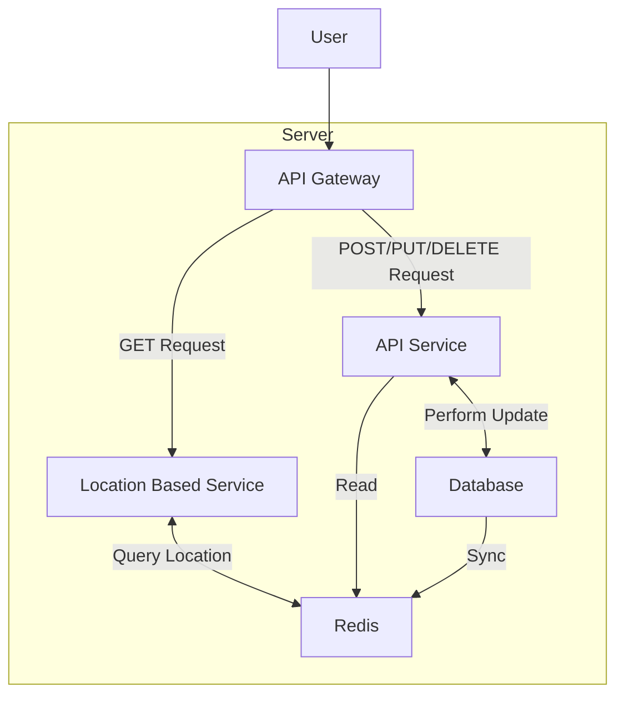
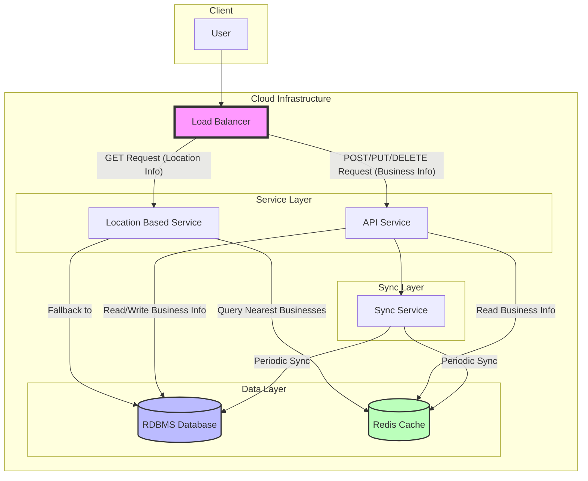
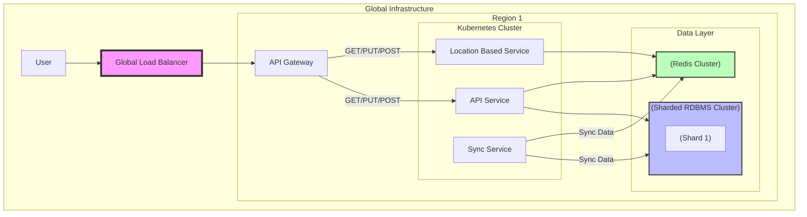

# Proximity Service

## Goals

- Estimating System Usage
    - [ ] Throughput (QPS for read and write queries)
    - [ ] Expected Latency in the System (Read/Write Queries)
    - [ ] Read/Write ratio
    - [ ] Traffic Estimates
    - [ ] Storage Estimates
    - [ ] Memory Estimates
- High-Level Design
    - [ ] Clear Requirements for Latency and Throughput
    - [ ] Consistency vs. Availability
    - [ ] API for Read/Write Scenarios of Key Components
    - [ ] Database schema
    - [ ] Key Algorithms Utilized
- Deep dive
    - [ ] Algorithm Scaling
    - [ ] Scaling Individual Components
    - [ ] Reason for Choosing and Usage Patterns of the Following Components

## Ideations

먼저 문제의 요구사항을 나열해 보자.

- 사용자 위치와 반경을 기준으로 사업장 목록 반환
- 사업장 정보 읽기 (요청의 대부분)
- 사업장 정보 수정 (비 실시간 반영)

일단 책에서는 DAU를 `100M`, 사업장 수는 `200M` 로 가정하고 사용자가 하루에 5회 검색을 시도한다고 가정해 $\text{QPS} = (100M \times 5) / (60 \times 60 \times 24)\quad(\approx5K)$ 라고 두었다.

먼저 위치 기반 서비스에서는 위치를 어떻게 다룰것이냐가 가장 중요하다. 이 서비스에서 대부분의 요청은 $f(Loc, Range) = \{ Loc_i \mid \text{dist}(Loc, Loc_i) \leq Range \}$ 이기 때문이다. 때문에 이를 저장하고 빠르게 탐색할 수 있는 알고리즘이 어떻게 보면 핵심이다. 하지만 우리가 목표로 하는 **대규모 시스템 설계**의 관점에서는 이를 어떻게 규모의 확장을 가능하게 하는지에 초점을 맞춰야 한다. 저장된 데이터에서 빠르게 검색이 가능하고, 적당한 크기로 저장될 수 있다면 나머지는 크게 중요하지 않다.

책에서는 **2차원 검색**, **균등 격자**, **Geohash**, **quadtree**, **Google S2**, **R-tree** 등을 소개하고 있다. 여기서 가장 쉽고 적당한 규모의 서비스에서 간단하게 구현할 수 있는 **Geohash**를 사용한다. 이러한 위치 색인 구현의 주안점은 작은 영역으로 분할하여 빠르게 검색할 수 있도록 만드는것으로 큰 차이가 없고, 추후에 색인 알고리즘이 병목이 되어 변경이 필요하다면 잘 알려진 방법으로의 개선은 크게 어렵지 않기 때문이다.

시작에 앞서 주어진 제약 사항을 기반으로, 간략한 전체 서비스 구성을 그려보자. 유저는 API Gateway를 통해 서비스에 접근하며, 위치 정보는 자주 업데이트 될 필요가 없으니, 위치 정보 요청은 자주 업데이트 될 필요없고 대부분 요청이 읽기임으로, GET 요청은  Location Based Service 를 통해 Redis 캐시에서 정보를 읽어올 수 있을 것이다. 사업장 정보등을 수정해야하는 POST/PUT/DELETE 요청은 API Service를 통해 Database에 접근할 것이며 이는 주기적으로 Redis와 동기화 될 것이다.



## Estimating System Usage

이제 아래의 질문에 대한 답을 찾아보자.

- [x] Throughput (QPS for read and write queries)
    - 우리는 $\text{QPS} = 5K$를 가정하고 있다.
- [x] Expected Latency in the System (Read/Write Queries)
    - 우리는 99%의 요청이 100ms 이내로 처리되어야 한다고 가정하자.
    - 이를 위해 우리는 읽기 요청에 대해 Redis를 사용할 것이다. Redis는 대부분의 요청을 1ms 이내로 처리할 수 있다.
- [x] Read/Write ratio
    - 사업장이 한달에 한번 정보 요청을 한다고 가정해보자.
    - 이 경우 $\text{Write QPS} = 200M / (60 \times 60 \times 24 \times 30) \approx 0.2K$ 이다.
    - 따라서 $\text{Read/Write ratio} = 5K / 0.2K = 25$
- [x] Traffic Estimates
    - $\text{Traffic} = \text{QPS} \times (\text{Request} + \text{Response})$
    - `Request`에는 사용자의 현재 위치 정보, 탐색 범위가 포함된다. 위치 정보는 위도 경도 형태로 요청될 것이다.
    - 아래와 같은 `Request payload`를 생각해 볼 수 있고 `Request payload size`는 넉넉히 100bytes 가정할 수 있다.
    ```json
    {
        "location": {
            "latitude": 37.123456,
            "longitude": 127.123456,
            "range": 5000,
        }
    }
    ```
    - `Response`에는 사업장 정보가 포함된다. 이를 paging하여 전송할 수 있다.
    - paing으로 50개의 사업장 정보를 전송한다고 가정하면, `Response payload size`는 넉넉히 10KB로 가정할 수 있다.
    ```json
    {
        "businesses": [
            {
                "name": "Starbucks",
                "location": {
                    "latitude": 37.123456,
                    "longitude": 127.123456,
                }
            },
            ...
        ]
    }
    ```
    - 따라서 $\text{Traffic} = (\text{QPS}=5K) \times ((\text{Request}=100B) + (\text{Response}=10KB)) \approx 400 \text{Mbps} \approx 50 \text{MB/s} $
    - 이는 크게 부담이 되지 않는다. 이후에는 CDN을 통해 확장이 가능하다.
- [x] Storage Estimates
    - 사업장 정보는 대략 1KB로 가정할 수 있다.
    - 사업자 정보는 RDBMS에 저장될 것이다. 데이터 예시는 아래와 같다.
    ```json
    {
        "name": "Starbucks",
        "location": {
            "latitude": 37.123456,
            "longitude": 127.123456,
        },
        "description": "The best coffee in the world",
        "phone": "010-1234-5678",
        "email": "admin@starbucks.com",
        "website": "https://starbucks.com",
    }
    ```
    - 따라서 $\text{Storage} = 200M \times 1KB \approx 200GB$
    - 이는 서비스가 10배 성장함을 고려해도 서비스 확장 전까지 단일 데이터 베이스로 유지 가능하다. 이후에는 샤딩이나 파티셔닝을 통해 확장이 가능하다.
- [x] Memory Estimates
    - Redis는 대략 5KB의 메모리를 사용한다고 가정하자.
    - 따라서 $\text{Memory} = 5K \times 5KB \approx 25MB$
    - 이는 단일 Redis 인스턴스로 충분하다. 이후에는 필요에 따라 Redis 클러스터를 통해 확장이 가능하다.

살펴보면 서비스 운영으로 꽤 이상적인 수치를 가정했음에도 불구하고, 대부분의 경우에는 단일 인스턴스로 수용 가능함을 알 수 있었다. 

## High-Level Design

물론 우리는 이 서비스가 엄청난 성공을 이뤄 크게 성장해서 확장해야할 때를 대비할 수 있어야 한다!

- [x] Clear Requirements for Latency and Throughput
    - 가정한 부분과 구체화 시킬 수 있는 부분을 다시 확인해보자.
        - Throughput
            - DAU: 100M
            - 사업장 수: 200M
            - 사용자가 하루에 5회 검색을 시도한다고 가정.
            - 사업장이 한달에 한번 정보 요청을 한다고 가정.
            - $\text{Read QPS} = (100M \times 5) / (60 \times 60 \times 24) \approx 5K$
            - $\text{Write QPS} = 200M / (60 \times 60 \times 24 \times 30) \approx 0.2K$
            - $\text{QPS} \approx 5K$
            - $\text{Read/Write ratio} = 5K / 0.2K = 25$
        - Payload size:
            - Read Request payload size: $100B$
                - 사용자의 현재 위치 정보, 탐색 범위가 포함된다.
            - Read Response payload size: $10KB$
                - 사업장 정보의 목록을 paging하여 전송한다.
            - Write Request payload size: $1KB$
                - 사업장 정보를 수정하는 요청의 크기
        - Traffic: $50MB/s$
            - $\text{Traffic} = (\text{Read QPS}=5K) \times ((\text{Request}=100B) + (\text{Response}=10KB)) + (\text{Write QPS} = 0.2K \times (\text{Write Request}=1KB))\approx 400 \text{Mbps} \approx 50 \text{MB/s} $
        - Storage: $200GB$
            - Size of single business info: $1KB$
            - $\text{Storage} = 200M \times 1KB \approx 200GB$
        - Memory: $25MB$
            - Size of single business info in Redis: $5KB$
            - $\text{Memory} = (QPS=5K) \times 5KB \approx 25MB$
    - 피크 타임에 100배의 요청이 발생한다고 가정해보자.
        - $\text{Peak QPS} = 100 \times 5K = 500K$
        - $\text{Peak Traffic} = 50 \text{MB/s} \times 100 = 5GB/s$
        - $\text{Peak Memory} = 25MB \times 100 = 2.5GB$

- [x] Consistency vs. Availability
    - 이 서비스는 사업장 정보가 실시간으로 업데이트 될 필요가 없고, 지연된 사업장 정보가 크게 영향을 끼치지 않을 수 있다.
    - 따라서 이 서비스는 가용성에 중점을 둬야 한다.
    - failover를 위해 Redis와 RDBMS에 대한 백업을 유지해야 한다.
    - replication 및 sharding을 통해 가용성을 높일 수 있다.
- [x] API for Read/Write Scenarios of Key Components
    - API Gateway를 통해 사용자는 위치 정보를 기반으로 사업장 정보를 요청할 수 있다.
    - Location Based Service는 Redis를 통해 위치 정보를 읽어올 수 있다.
    - API Service는 RDBMS를 통해 사업장 정보를 읽고 쓸 수 있다.
    - API Service는 주기적으로 Redis와 동기화를 수행한다.
    - API Service는 CRUD API를 제공한다.
        - Create: `POST /businesses`
        - Read: `GET /businesses/:id`
        - Update: `PUT /businesses/:id`
        - Delete: `DELETE /businesses/:id`
    - Location Based Service는 위치 정보를 기반으로 사업장 정보를 읽어올 수 있다.
        - GET `/businesses?latitude=37.123456&longitude=127.123456&range=5000`
- [x] Database schema
    - RDBMS에서 아래의 스키마를 사용할 수 있다.
    ```sql
    CREATE TABLE businesses (
        id INT AUTO_INCREMENT PRIMARY KEY,
        name VARCHAR(255) NOT NULL,         -- Store name
        address VARCHAR(255),               -- Optional address field
        geohash VARCHAR(12) NOT NULL,       -- Geohash of the store location (e.g., level 8 or finer)
        latitude DECIMAL(10, 7) NOT NULL,   -- Latitude for exact positioning
        longitude DECIMAL(10, 7) NOT NULL,  -- Longitude for exact positioning
        other_info JSON,                    -- Optional JSON field for additional store info
        INDEX idx_geohash (geohash)         -- Index on geohash for fast querying
    );
    ```
    - 아래와 같이 요청할 수 있다.
    ```sql
    SELECT * 
    FROM stores
    WHERE geohash LIKE 'u4pruyd%'   -- 'u4pruyd' is an example geohash prefix
    LIMIT 10;                       -- Limit results as needed
    ```
    
    - 아래와 같이 크기를 가지고 있으므로 위에서 가정한 $1KB$의 크기는 충분하다.

    | Component                  | Estimated Size (Bytes)          |
    |----------------------------|---------------------------------|
    | `id`                       | 4                               |
    | `name`                     | up to 255 |
    | `address`                  | up to 255 |
    | `geohash`                  | 13 (12 characters + length byte) |
    | `latitude`                 | 5                               |
    | `longitude`                | 5                               |
    | `other_info` (JSON)        | Up to 5000   |
    | **Total (without indexes)**| **up to 5587 bytes**   |
    | Index overhead             | ~200 - 300     |
    | **Total with Indexes**     | **up to 5887 bytes**            |

    - [x] Key Algorithms Utilized
        - Geohash를 사용하여 위치 정보를 색인화하고 빠르게 검색할 수 있다.

## Deep dive

먼저 처음 제시한 구조를 살펴보면 아래와 같다.



이 구조도 충분하지만 우리는 더 나아가서 서비스를 더 세분화하고, 지역별로 서비스를 분리하여 확장성을 높일 수 있다.

- RDBMS sharding 및 replication
    - Geohash 기반으로 데이터를 색인화하고, 지역별로 데이터를 분리하여 저장할 수 있다.
    - 각 샤드에 특정 지리적 지역 관련 데이터를 저장하여 데이터베이스의 부하를 분산할 수 있다.
    - 샤드 키로 Geohash의 prefix를 사용할 수 있다.
    - 분산 쿼리를 활용해 샤드 간 데이터를 조인할 수 있다.
    - 각 샤드에 대해 복제본을 유지하여 가용성을 높일 수 있다.
- Redis sharding 및 replication
    - Redis 클러스터 또한 지역별로 배포하여 데이터를 분산할 수 있다.
- API 서버 kubernetes 클러스터
    - API 서버를 kubernetes 클러스터로 배포하여 확장성을 높일 수 있다.
    - 각 지역별로 API 서버를 배포하여 지역별로 서비스를 제공할 수 있다.
    - Pod 자동 확장: CPU 사용량이 높아지면 각 서비스 수요에 따라 자동으로 Pod를 확장할 수 있다.
    - 로드밸런서: 지역 로드 밸런서를 활용하여 지리적 근접성에 따라 사용자를 서비스에 연결할 수 있다.
- 알고리즘
    - PostGIS for Postgres: 지리적 데이터를 저장하고 쿼리할 수 있는 Postgres 확장을 사용할 수 있다.
- 데이터 동기화
    - Sync Service를 통해 Redis와 RDBMS 간 데이터를 주기적으로 동기화할 수 있다.
    - 데이터 동기화는 지역별로 분리하여 수행할 수 있다.
    - 글로벌 동기화 필요 없이 단일 지역 내의 최신 상태 유지에만 중점을 둘 수 있다.


