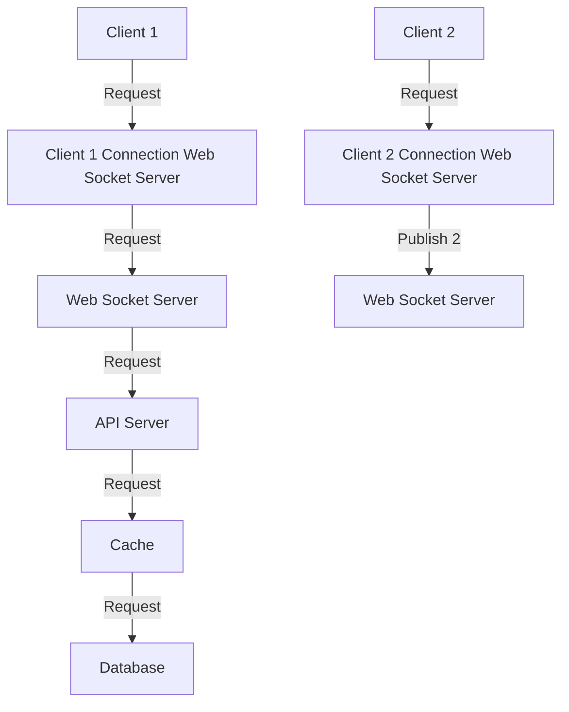

# Proximity Service

## Goals

- Estimating System Usage
    - [ ] Throughput (QPS for read and write queries)
    - [ ] Expected Latency in the System (Read/Write Queries)
    - [ ] Read/Write ratio
    - [ ] Traffic Estimates
    - [ ] Storage Estimates
    - [ ] Memory Estimates
- High-Level Design
    - [ ] Clear Requirements for Latency and Throughput
    - [ ] Consistency vs. Availability
    - [ ] API for Read/Write Scenarios of Key Components
    - [ ] Database schema
    - [ ] Key Algorithms Utilized
- Deep dive
    - [ ] Algorithm Scaling
    - [ ] Scaling Individual Components
    - [ ] Reason for Choosing and Usage Patterns of the Following Components

## Ideations

먼저 문제의 요구사항을 나열해 보자.

- 사용자는 모바일 앱에서 주변 친구를 확인할 수 있어야한다.
    - 해당 친구까지의 거리, 마지막 갱신된 시각을 확인할 수 있어야 한다.
    - 해당 목록은 몇 초마다 갱신되어야한다.
- 낮은 지연 시간을 가져야 실시간을 달성할 필요는 없다.
- 시스템 전반적으로 안정적 이어야 하지만 때로 몇 개 데이터가 유실되어도 괜찮다.
- 위치 데이터를 저장하는데 강한 일관성을 지원할 필요는 없다.
- 복제본의 데이터가 원본과 동일하게 변경되기 까지 몇 초 정도 용인할 수 있다.

먼저 이 책에서의 가정을 따라가자.

- 반경 8km 이내의 친구를 검색할 수 있어야 한다.
- 친구 정보는 30초 주기로 갱신한다.
- 평균적으로 매일 주변 친구 검색 기능을 활용하는 사용자는 1억명으로 가정한다.
- 동시 접속 사용자의 수는 DAU의 10%로 가정, 즉 1천만명이다.
- 평균적으로 사용자는 400명의 친구를 갖는다고 가정하고 모두 주변 친구 검색을 시도한다.

위 가정을 바탕으로 QPS를 계산해보자.
- $\text{DAU} = 100,000,000$
- $\text{동시 접속 사용자} = 10\% \times \text{DAU} = 10,000,000$
- $\text{Update Frequency} = 30\text{초} = 1 / 30$
- $\text{QPS} = \text{동시 접속 사용자} \times \text{Update Frequency} = 10,000,000 \times 1 / 30 \approx 334,000$

다음으로 시스템의 전체적인 구조를 생각해보자.

여기에 Redis pub/sub를 사용해 데이터를 갱신하는 방법을 생각해보자. Redis를 활용해 웹소켓 서버를 API서버와 별도로 위치해두고 웹소켓 서버는 Redis pub/sub를 활용해 데이터를 갱신하고, API서버는 RDB를 통해 정보를 갱신한다.

- redis의 pub/sub 기능을 활용하여 경량의 메시지를 전달한다.
- 메시지의 유실이 발생할 수 있는 단점이 있지만, 현재 서비스 요구사항에서 이는 큰 문제가 되지 않을 것으로 판단된다.
- 웹소켓 서버는 API 서버와 별도로 위치해있으며, API 서버는 RDB를 통해 데이터를 갱신한다.
- 웹소켓 서버는 Redis pub/sub를 통해 데이터를 갱신하고, API 서버는 RDB를 통해 정보를 갱신한다.

모바일 클라이언트는 항구적으로 유지되는 웹소켓 연결을 통해 주기적으로 위치 변경 내용을 전송한다.

1. 모바일 클라이언트가 위치가 변경된 사실을 전송한다.
2. 로드 밸런서는 그 위치 변경 내역을 해당 클라이언트와 웹소켓 서버 사이에 설정된 연결을 통해 웹소켓 서버로 내보낸다.
3. 웹소켓 서버는 해당 이벤트를 위치 이동 이력 데이터베이스에 저장한다. (optional)
4. 웹소켓 서버는 새 위치를 위치 정보 캐시에 보관한다 (Redis), 이 때 TTL을 갱신한다.
5. 웹소켓 서버는 레디스 pub/sub server의 해당 사용자 채널에 새 위치를 발행한다. 이로 인해 각 사용자는 새 위치를 수신한다.
6. 레디스 pub/sub 채널에 발행된 새로운 위치 변경 이벤트는 모든 구독자 (온라인 상태의 친구) 에게 업데이트 된다. 그 결과 모든 친구는 새 위치를 수신한다.
7. 메세지를 받은 웹소켓 서버는 새 위치를 보낸 사용자와 그 토픽을 구독하는 사용자 (온라인 상태의 친구) 사이의 거리를 계산한다.
8. 웹소켓 서버는 거리를 사용자에게 보내고, 사용자는 해당 정보를 화면에 표시한다.

위와 같은 방식으로 사용자의 위치 정보를 실시간으로 갱신할 수 있다.

