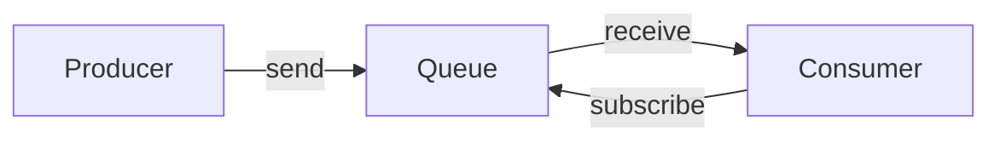
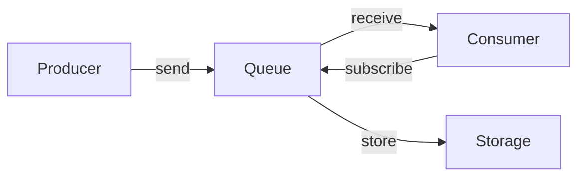
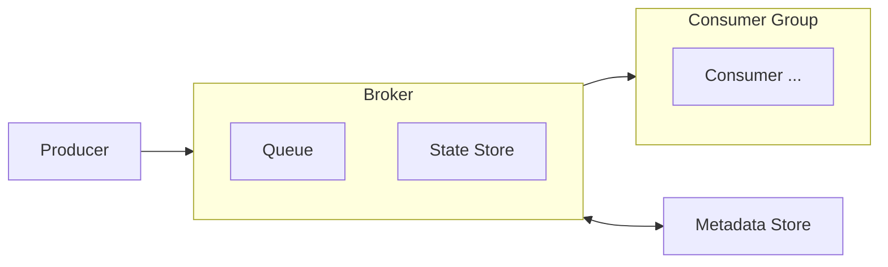
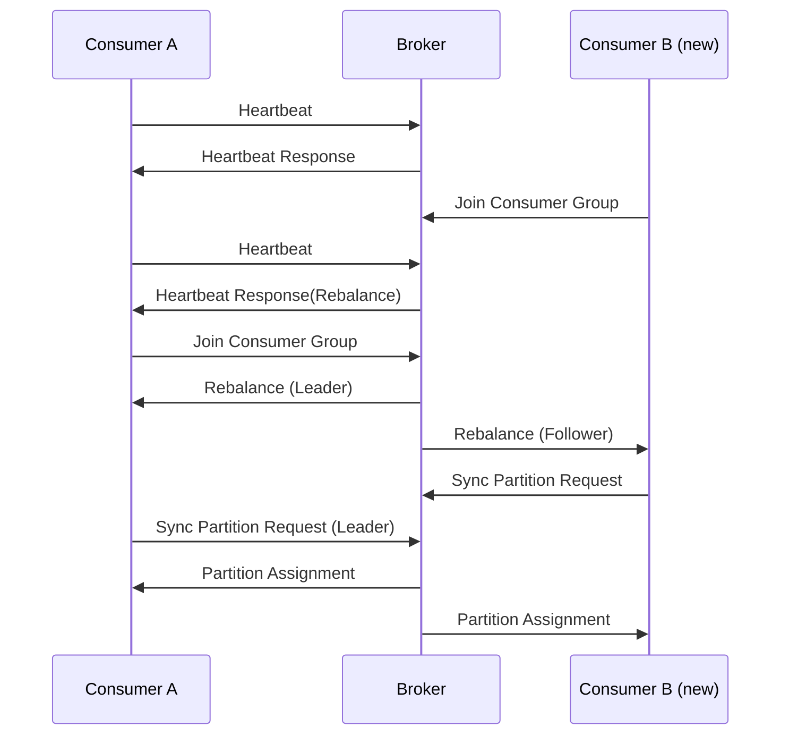
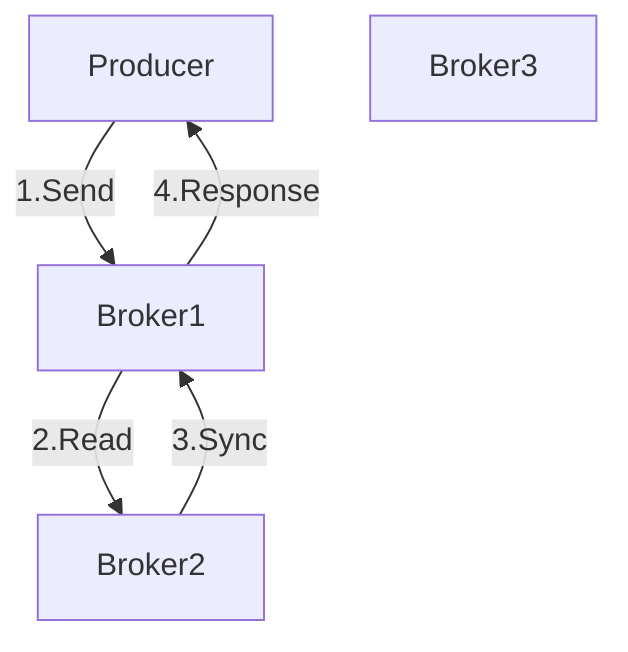
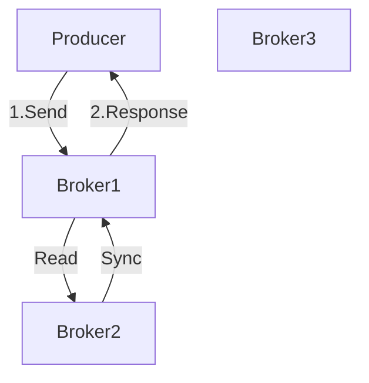
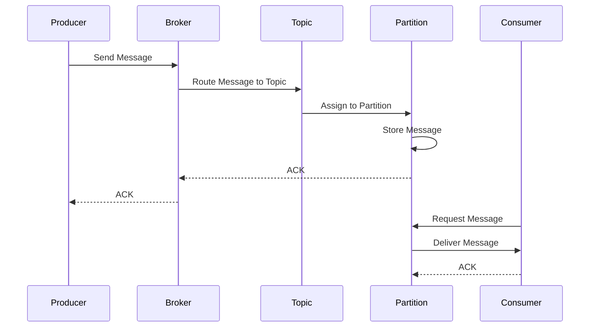
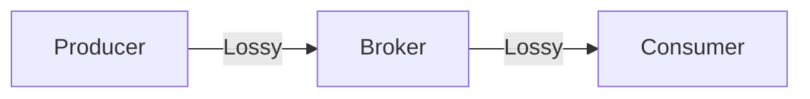

# Message Queue

## What is a message queue?

이번 장에서는 분산 메세지 큐 설계에 대해 알아본다. 분산 메세지 큐는 시스템 내에서 각 구성요소 사이에 배치되어 결합도를 완화하고 비동기 통신을 가능하게 한다. 이를 통해 시스템의 확장성과 유연성을 쉽게 높일 수 있다.

메세지 큐의 기본 기능은 ***생산자는 큐에 메세지를 보내고, 소비나는 큐에서 메세지를 꺼낼 수 있다***로 요약된다. *성능*, *메세지 전달 방식*, *데이터 보관 기간* 등 다양한 요소에 따라 메세지 큐의 성능과 특성이 달라진다.


*Simple message queue*

유명한 분산 메세지 큐로는 아래와 같은 제품들이 있다.

- [RabbitMQ](https://www.rabbitmq.com/)
- [Apache Kafka](https://kafka.apache.org/)
- [Apache Pulsar](https://pulsar.apache.org/)

Apache Kafka, Pulsar 는 엄밀하게 메세지 큐 보다는 Event streaming platform 으로 불리운다. 하지만 이 둘은 수렴하고 있어서 차이가 희미해지고 있다. 이번 장에서는 *데이터 장기 보관*, *메세지 반복 소비* 등의 부가 기능을 갖춘 분산 메세지 큐를 설계할 것이기 때문에 Event streaming platform과 메세지 큐의 차이는 크게 중요하지 않다.

이번 장에서는 분산 메세지 큐 자체를 설계함으로 별다른 가정이나 디자인을 추가하지 않고, 책에서의 설명을 최대한 따라가면서 부족한 부분과 더 생각해볼 부분이 있는지를 위주로 알아본다.

## System Design

해당 책에서는 아래와 같은 요구사항을 가정하고 있다.

- 생산자는 메세지 큐에 메세지를 보낼 수 있다.
- 소비자는 메세지 큐에서 메세지를 가져갈 수 있다.
- 메세지는 반복적으로 수신할 수도 있어야하고, 단 한번만 수신하도록 설정될 수도 있어야한다
- 메세지는 일정 기간 보관되어야 하지만, 오래된 메세지는 삭제될 수 있다.
- 메세지가 발행된 순서대로 소비자에게 전달되어야 한다.
- 높은 대역폭과 낮은 전송 지연을 제공해야 한다.
- 메세지 양이 증가하면 확장 가능해야한다.
- 데이터는 지속적으로 보관되어야 하며 여러 노드에 복제될 수 있다.

전통적인 메세지 큐는 *메세지 보관 문제를 중요하게 다루지 않고*, *전달 순서도 보장하지 않는다*.

### Architecture Design in sketch

책의 다음장을 읽기 전에 간단하게 메세지 큐 시스템을 만들어 보자.



아래와 같은 생각을 해볼 수 있다.

- Producer와 Consumer는 클라이언트로, Queue는 서버라고 생각할 수 있을 것이다.
- 간단한 메세지 큐를 구성하고 메세지 보관, 복제 기능등이 없다고 고려하면 메세지는 메모리에 저장되고 보관되지 않는것으로 두거나, 간단히 파일 시스템을 활용해 저장해도 가능할 것이다.
- 메세지 구조는 소비자에게 전달될때까지 변경되지 않아야 메모리 복사등을 최소화 할 수 있을 것이다.
- 메세지는 소비되면 삭제해서 단 한번만 수신하도록 할 수 있을 것이다.
- 소비자는 큐에 메세지가 발행되었는지 풀링하면서 메세지를 받아갈 수 있다.

여기서 생기는 의문점은 아래와 같았다.

- 보통 메세지큐에서 사용되는 AMQP는 어떠한 조건을 만족하는가?
- 토픽, 파티션, 브로커 등의 개념은 어떻게 설계해야 하는가?
- at-most-once, at-least-once, exactly-once 는 어떻게 보장할 수 있는가?
- scale-out을 위해서 고려되어야 하는 점은 무엇인가?

이러한 궁금정을 가지고 책으로 돌아가서 다음 장을 읽어보자.

### Message Model, Topic, Consumer Group 

책에서는 메세지 모델로 일대일(point-to-point)과 발행-구독(publish-subscribe) 모델을 설명한다.

일대일 모델은 큐에 전송된 메세지를 한 소비자만 소비하는 간단한 모델이다. 어떤 소비자가 메세지를 소비하면 이를 알리고 해당 메세지가 큐에서 삭제되는 방식으로 작동한다.

발행-구독 모델에서는 topic이라는 논리적 채녈 개념이 존재하고, 메세지를 주제별로 정리하는데 사용한다. Producer는 topic에 메세지를 발행하고, Consumer는 topic을 구독하여 메세지를 수신한다. 이 모델에서는 토픽에 전달된 메세지는 해당 토픽을 구독하는 모든 소비자에게 전달된다.
토픽에 메세지가 보관될 때 scale-out 할 수 있도록 파티션을 지원한다. 토픽을 여러 파티션으로 분할한 다음 메세지를 파티션에 분배하여 병렬로 처리할 수 있다. 이렇게 하면 토픽의 처리량이 불균형 해질 수 있지만, 이는 추후에 설명될 분배 전력을 통해 해결한다.

소비자 그룹은 메세지 큐에서 소비자를 관리하는 논리적 단위이며, 토픽을 구독하는 소비자의 집합이다. 여러 소비자가 하나의 토픽을 구독하는 경우 메세지를 효율적으로 처리하기 위해 이를 논리적 단위로 묶어 관리한다. 토픽에 메세지가 발행되면 소비자 그룹 내의 모든 소비자에게 전달된다. 같은 소비자 그룹에서는 메세지가 하나의 소비자에게만 전달되어야 한다.

이를 반영하여 설계도를 수정해보자.



## Architecture Design in detail

데이터 장기 보관 요구 사항을 만족하면서 높은 대역폭을 제공하기 위해 책에서는 아래와 같은 결정을 내렸다.

- 메세지는 디스크에 저장한다. 현대적 운영체제가 제공하는 디스크 캐시 전략을 이용하면 훌륭한 가성비로 메세지를 저장할 수 있다.
- 메세지가 발행되고 소비될때까지 수정 없이 전송되도록 메세지 자료 구조를 설계해야 한다.
- batching을 적극적으로 활용해 대역폭을 높인다.

위 이유들은 충분히 납득이 가능 이유다. 추후에 디스크 I/O가 병목이라면 더 높은 금액을 지불하여 SSD를 사용하거나, 메모리 캐시를 적극적으로 활용하여 메세지를 저장할 수 있을것이다. 언제나 복사 비용은 크기 때문에 최소화 할 수 있으면 좋다. 또한 batching은 대역폭을 높이는데 중요한 요소이다.

### Datastore

메세지를 저장하는 데이터 저장소는 아래와 같은 요구사항을 만족해야 한다.

- 읽기, 쓰기가 빈번하게 일어나며 대부분 순차적이다.
- 갱신, 삭제 연산은 불필요하다.

이러한 요구사항을 보았을때 일반적인 데이터베이스는 불필요한 기능들을 지원하기 위해 성능을 하락시킬 우려가 있다. 보통 순차적 읽기/쓰기 연산은 현대적 파일 시스템에서의 파일로 충분하다. 이 책에서는 WAL(write-ahead-log)을 소개하며 선택한다. WAL은 append-only 파일로, 메세지를 순차적으로 저장할 수 있도록 해준다.

WAL을 활용하면서 적당한 크기의 세그먼트로 나누어 관리하면서, 활성화된 세그먼트에 새 메세지가 발행되고 오프셋을 이용해 메세지를 읽어올 수 있다. 또한 파티션을 위해 별도의 파일을 생성하여 메세지를 저장할 수 있다.

### Message structure

메세지 자료구조는 발행/소비 되는 메세지를 감싸면서 토픽, 파티션, 오프셋등을 포함해서 전달될 수 있도록 해야한다.

- 메세지 키가 존재해 파티션을 결정할 때 사용한다. 이는 비워질 수 있으며 특정 파티션에 할당되어야할때 사용한다.
- 메세지 값은 메세지 내용을 담고있다.
- topic, partition, offset 은 메세지가 소비되는 위치를 결정한다.
- timestamp, size, checksum 은 메세지의 메타데이터를 담고있다.

위 내용에 따라 메세지 구조는 아래와 같이 설계할 수 있다.

```protobuf
message Message {
    bytes key = 1;
    required bytes value = 2;
    required string topic = 3;
    required integer partition = 4;
    required int64 offset = 5;
    required int64 timestamp = 6;
    required int32 size = 7;
    required int32 checksum = 8;
}
```

### Batching

메세지를 배치로 처리하면 대역폭을 높일 수 있다. 메세지를 디스크에 저장할 때도 배치로 처리하면 디스크 I/O를 줄일 수 있다. 메세지를 배치로 처리할 때는 아래와 같은 방법을 사용할 수 있다.
하지만 이렇게되면 응답 지연이 발생할 수 있으므로 적절한 크기로 배치를 처리해야한다.


### Push-Pull

소비자가 메세지를 큐에서 가져갈 것인가 큐에서 소비자에게 메세지를 전달할 것인가에 대한 방법이다. 이는 push 방식과 pull 방식으로 나뉜다.

- push 방식은 큐에서 소비자에게 메세지를 전달하는 방식이다. 이는 메세지를 받는 즉시 소비자에게 전달할 수 있다. 하지만 소비자의 메세지 처리 속도를 고려할 수 없으므로 소비자에게 부하가 걸릴 수 있다.
- pull 방식은 소비자가 메세지를 가져가는 방식이다. 이는 소비자가 메세지를 가져가는 시점에만 메세지를 전달할 수 있으므로 소비자의 처리 속도에 맞춰 메세지를 전달할 수 있다. 하지만 소비자가 메세지를 가져가지 않으면 메세지가 큐에 남아있을 수 있다. 또한 메세지가 없어도 소비자가 계속해서 풀링을 시도해 자원이 낭비될 수 있다.

### Consumer re-balancing

위에서 언급했듯, 소비자 그룹은 여러 소비자로 구성되어 있으며, 토픽을 구독하는 소비자의 집합이다. 이러한 소비자 그룹은 여러 소비자가 하나의 토픽을 구독하는 경우 메세지를 효율적으로 처리하기 위해 이를 논리적 단위로 묶어 관리한다. 토픽에 메세지가 발행되면 소비자 그룹 내의 모든 소비자에게 전달된다. 같은 소비자 그룹에서는 메세지가 하나의 소비자에게만 전달되어야 한다.

다만 어떤 소비자에 장애가 발생하거나, 소비자가 추가/제거 되는 경우 또는 파티션이 조정되는 경우 어떤 소비자가 어떤 파티션을 처리해야하는지 재조정이 필요하다. 이를 re-balancing 이라고 한다.

먼저 소비자는 브로커에게 주기적으로 heartbeat를 보내 소비자의 상태를 알린다. 브로커는 이를 통해 소비자의 상태를 파악하고, 소비자가 장애가 발생하면 다른 소비자에게 파티션을 재할당한다. 또한 소비자 그룹에는 리더와 팔로워가 존재한다. 리더는 소비자 그룹을 관리하고, 팔로워는 리더의 상태를 복제한다. 리더가 장애가 발생하면 팔로워 중 하나가 리더가 되어 리더의 역할을 대신한다. 이를 통해 소비자 그룹의 상태를 유지할 수 있다.



이는 소비자가 소비자 그룹에서 떠나거나 정상적인 heartbeat가 없어 제거되는 과정에서도 비슷한 방법으로 적용된다.

### 사본 동기화 및 ACK

메세지가 소비자에게 전달되면 소비자는 메세지를 처리하고 ACK를 보낸다. 이를 통해 브로커는 메세지가 소비되었음을 알 수 있다. 이때 메세지는 복사본을 가지고 있어야 한다. 이를 통해 메세지가 소비자에게 전달되었지만 소비자가 ACK를 보내지 않아 메세지가 손실되는 경우를 방지할 수 있다.

#### ACK=ALL

이 경우는 모든 사본이 동기화 되어야 ACK를 보낼 수 있다. 때문에 가장 느린 동기화를 기다려야 하므로 전체적인 처리 속도가 느려질 수 있지만 데이터 영속성 측면에서 안전하다.



#### ACK=1

이 경우는 리더가 메세지를 저장하면 바로 ACK를 보낼 수 있다. 이는 빠른 처리 속도를 가질 수 있지만, 리더가 장애가 발생하면 데이터 손실이 발생할 수 있다.



#### ACK=0

이 경우는 메세지를 저장하면 바로 ACK를 보낼 수 있다. 이는 가장 빠른 처리 속도를 가질 수 있지만, 데이터 손실이 발생할 수 있다. metric, log와 같은 데이터 손실이 발생해도 상관없는 경우 사용할 수 있다.


### Workflow

위 내용을 종합하여 메세지 큐의 동작을 설명하면 아래와 같다.



## Message delivery (at-most-once, at-least-once, exactly-once)

### At-most-once

메세지가 한번만 전달되는 것을 보장한다.

- 생산자는 토픽에 비동기적으로 메세지를 보내고 수신 응답을 기다리지 않는다 (ACK=0)
- 소비자는 메세지를 받기 전에 오프셋부터 갱신한다. 해당 메세지는 소비자가 장애로 인해 처리하지 못해도 다시 소비되지 않는다.



### At-least-once

메세지가 최소 한번은 전달되는 것을 보장한다. 이는 메세지 소실이 발생하지 않아야 한다.

- 생산자는 메세지를 보내고 ACK=1, ALL을 기다린다.
- 소비자는 데이터를 처리한 후에 오프셋을 갱신한다. 이때 소비자가 장애로 인해 처리하지 못한 경우 메세지는 오프셋이 갱신되지 않았기 때문에 다시 소비될 수 있다.
- 이 경우 메세지가 소실되진 않지만 같은 메세지가 여러번 전송될 수 있다.

### Exactly-once

메세지가 정확히 한번만 전달되는 것을 보장한다. 이를 위해서는 시스템 성능을 대가로 지불한다.

- 메세지에 고유한 ID를 부여한다. 이를 통해 중복 메세지를 필터링할 수 있다.
- 메세지를 처리하는 작업을 트랜잭션 내에서 수행하여 트랜잭션이 완전히 커밋되지 않는 한 소비자가 메세지를 다시 소비하지 않도록 한다.
