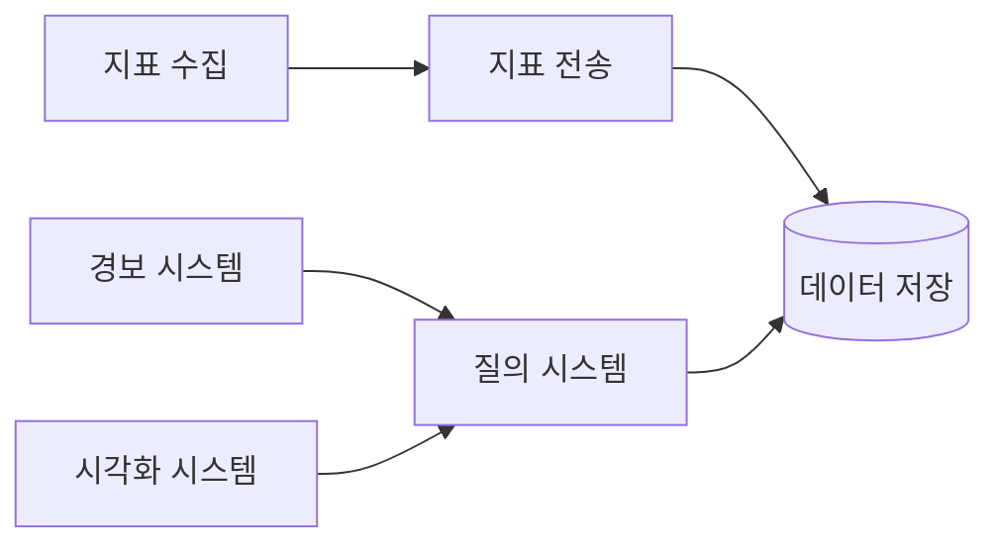
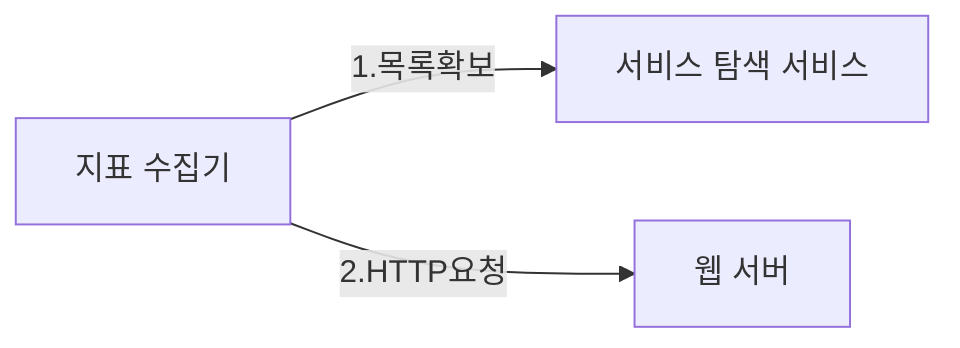
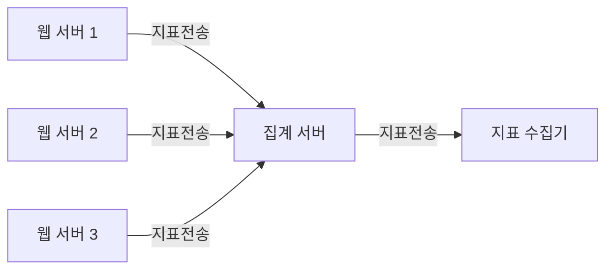
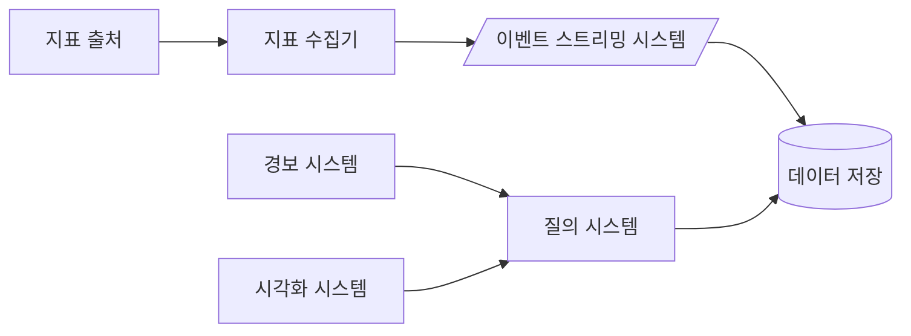
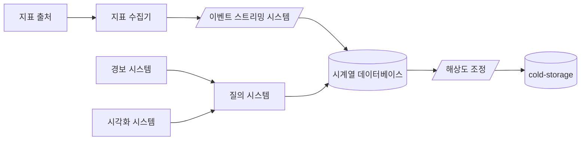
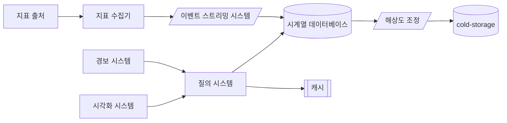
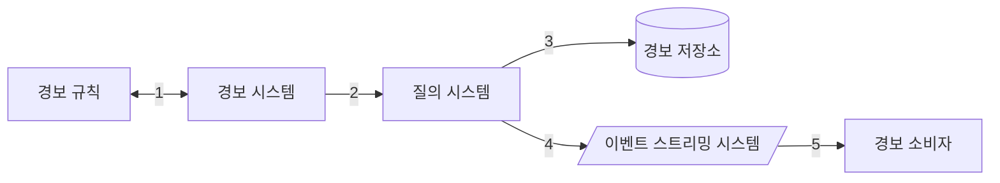
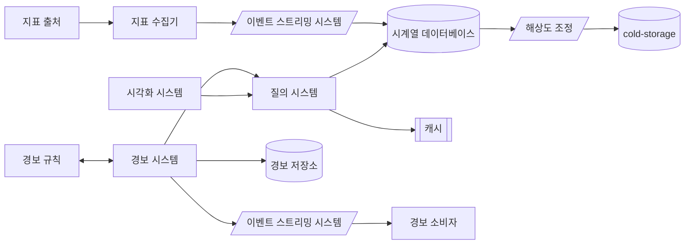

# Metrics monitoring and alerting system

## 1. 설계 범위 및 요구사항

이번장에서는 메트릭 모니터링 및 경보 시스템을 설계한다. 보통 `Prometheus`, `Grafana`, `DATADOG`, `Graphite` 와 같이 널리 알려진 시스템들이 있다.

지표 모니터링 및 경보 시스템은 회사마다 요구사항이 다를 수 있기 때문에 정확한 요구사항을 확정하는것이 중요하다.

책에서는 다음과 같은 개략적 요구사항을 가정하고 있다.

- 일간 능동 사용자 수 100M
- 서버 풀, 1K, 풀당 서버 수 100, 서버당 운영지표 100개 $\approx 10M$
- 데이터 보관 기간은 1y
- 데이터 해상도는 시간에 따라 변화될 수 있음
- 모니터링할 지표는 다음과 유사함.
    - 서버 CPU, 메모리, 디스크 사용량
    - 서버 네트워크 사용량
    - 요청 수, 응답 시간
    - 메세지 큐 내의 메세지 수

지표 모니터링 및 경보 시스템은 다음과 같은 세부 구성 요소로 나눌 수 있다.

- 지표 수집: 여러 소스로부터 지표 수집
- 지표 전송: 수집된 지표를 저장소로 전송
- 데이터 저장: 수집된 지표를 저장
- 경보: 지표를 기반으로 경보를 생성
- 시각화: 저장된 데이터를 시각화

## 2. 상세 설계 및 주의점

상세 설계에서는 위의 각 구성요소를 어떤 점을 주의하면서 어떻게 설계해야하는지 알아본다.

### 2.1 지표 수집

지표를 수집할 때 대부분의 지표는 데이터가 손실 되어도 아주 심각한 문제는 아니다. 또한 많은 채널에서 많은 지표를 수집해야하기 때문에 지표 수집 시스템의 가용성을 위해서 지표를 보내는 클라이언트는 데이터가 성공적으로 전송되었는지 확인하지 않는 편이 좋다.

지표 데이터는 이전 장에서 메세지 큐의 소비자가 메세지를 처리하는 방법과 유사하게 풀/푸시 모델이 있다. 각 방법은 장단점이 있어 상황에 맞게 선택해야한다.

**풀 모델**은 etcd나 아파치 주키퍼 같은 서비스 탐색 서비스를 활용하여 지표 수집기가 서비스를 찾아가서 지표를 수집하는 방법이다. 메타데이터에 지표 수집 주기, IP 주소, 타임 아웃 등을 저장하고 지표 수집기는 이 메타데이터를 이용하여 지표를 수집한다.

이러한 지표 수집 서비스는 수집해야할 지표 및 서버가 늘어나게 되면 확장 가능해야한다. 이는 이전에 알아본 안정 해시 등을 활용하면 "데이터가 손실되어도 아주 심각한 문제는 아니다" 라는 가정하에 확장성을 높일 수 있다.

**푸시 모델**은 지표를 생산하는 서버가 지표 수집기에 직접 지표를 전송하는 모델이다. 이 경우 지표 수집기에 큰 부하가 생길 수 있기 때문에 이를 방지하기 위해 데이터 집계를 통해 지표를 전송하는 방법을 사용할 수 있다.

두 모델에 언제나 옳은 정답은 없으므로 책의 표 5.3을 참고해 상황에 맞게 선택해야한다.

### 2.2 지표 전송 파이프라인

지표 수집기는 엄청난 양의 데이터를 처리할 수 있어야하므로 이전 장에서 논의했던 카프카와 같은 이벤트 스트리밍 시스템을 활용할 수 있다. 이 부분은 이전장에서 규모의 확장성을 충분히 논의했으므로 생략한다.

### 2.3 데이터 저장

데이터 저장은 해당 시스템의 핵심이다. 지표 모니터링 및 경보 시스템에서는 시계열 데이터 쓰기 연산이 많이 발생하므로 기존의 범용 데이터 베이스 시스템을 그대로 활용하는것은 무리가 있다. 이러한 이유로 시계열 데이터베이스를 사용하는것이 좋으며 책에서는 InfluxDB, Prometheus를 소개하고 있다.

이러한 시계열 데이터는 유사한 패턴의 값이 많이 발생하므로 데이터를 인코딩하고 압축하면 저장 공간을 효과적으로 절약할 수 있다. 또한 데이터를 쿼리할 때도 데이터를 압축해놓으면 더 빠르게 쿼리할 수 있다. 또한 데이터 저장시 기간별로 해상도를 낮추어 저장할 수 있으므로 데이터 저장 공간을 효과적으로 사용할 수 있다.

이렇게 해상도가 줄어들었거나 잘 사용되지 않는 비활성 데이터를 장기 보관할 때는 cold-storage를 활용할 수 있다.

### 2.4 질의 서비스

질의 서비스는 시각화 또는 경보 시스템에서 사용자가 요청한 데이터를 가져오는 역할을 한다. 이러한 서비스는 데이터를 쿼리할 때 빠르게 가져오기 위해 캐시를 사용할 수 있다. 또한 데이터를 캐시할 때는 데이터의 유효기간을 설정하여 캐시를 효과적으로 사용할 수 있다.

### 2.5 경보 시스템

경보 시스템은 지표를 기반으로 경보를 생성하는 시스템이다. 경보 생성을 위한 규칙 파일이 존재하고 이를 경보 서비스가 질의 서비스에 요청하여 해당 규칙을 통해 경보를 생성하고 이를 경보 소비자에게 전달한다.

여기에도 경보 소비자에게 작업을 전달하기 위해 중간에 이벤트 스트리밍 시스템을 사용할 수 있다.

### 2.6 시각화 시스템

시각화 시스템은 Grafana와 같이 다양한 지표를 다양한 범위로 표시하고 상태를 일목요연하게 볼 수 있도록 한다.

위에서 언급한 내용들을 정리하면 다음과 같다.

